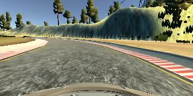
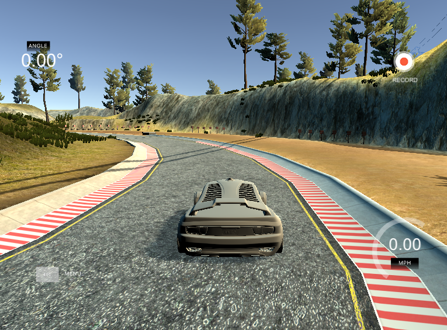

#**Behavioral Cloning**

**Behavioral Cloning Project**

The goals / steps of this project are the following:
* Use the simulator to collect data of good driving behavior
* Build, a convolution neural network in Keras that predicts steering angles from images
* Train and validate the model with a training and validation set
* Test that the model successfully drives around track one without leaving the road
* Summarize the results with a written report

## Rubric Points
###Here I will consider the [rubric points](https://review.udacity.com/#!/rubrics/432/view) individually and describe how I addressed each point in my implementation.  

---

#### 1. Submission includes all required files and can be used to run the simulator in autonomous mode

My project includes the following files:
* model.py containing the script to create and train the model
* drive.py for driving the car in autonomous mode
* model.h5 containing a trained convolution neural network
* writeup_report.md or writeup_report.pdf summarizing the results

#### 2. Submission includes functional code
Using the Udacity provided simulator and my drive.py file, the car can be driven autonomously around the track by executing
```sh
python drive.py model.h5
```

#### 3. Submission code is usable and readable

The model.py file contains the code for training and saving the convolution neural network. The file shows the pipeline I used for training and validating the model, and it contains comments to explain how the code works.

### Model Architecture and Training Strategy

#### 1. An appropriate model architecture has been employed

My model makes use of the Convolutional Neural Network model laid out in nVidia's End to End learning paper (model.py lines 40-54). Additional dropout layers were added to improve the network's performance.

The model includes RELU layers to introduce nonlinearity (code lines 43-47), and the data is normalized in the model using a Keras lambda layer (code line 41). The data is also initially cropped to remove unnecessary background information in the top and bottom parts of the image (code line 42).

#### 2. Attempts to reduce overfitting in the model

The model contains dropout layers in order to reduce overfitting (model.py line 50). Adding more dropout dropout layers caused the car to go off track in several areas. Also, the dropout of 0.5 turned out to be the optimum value here in order to ensure the car stays on track.

The model was trained and validated on different data sets to ensure that the model was not overfitting (code line 57). The model was tested by running it through the simulator and ensuring that the vehicle could stay on the track.

#### 3. Model parameter tuning

The model used an adam optimizer, so the learning rate was not tuned manually (model.py 54).

#### 4. Appropriate training data

Training data was chosen to keep the vehicle driving on the road. I used a combination of center lane driving, recovering from the left and right sides of the road. I drove the car for multiple laps in clockwise and anticlockwise directions. Additionally, more data was collected near the sharp curves on the road.

For details about how I created the training data, see the next section.

### Model Architecture and Training Strategy

#### 1. Solution Design Approach

The overall strategy for deriving a model architecture was to implement the popular CNN architecture employed by nVidia.

I thought this model might be appropriate because of successful results outlined by nVidia on using the architecture.

In order to gauge how well the model was working, I split my image and steering angle data into a training and validation set. The mean squared error on both the validation and test set decreased and did not differ by a large margin.

The final step was to run the simulator to see how well the car was driving around track one. There were a few spots where the vehicle fell off the track due to sharp turns. In order to improve the driving behavior in these cases, I recorded more data by driving to the edge of the road and recovering from the position by a steep steering angle.

At the end of the process, the vehicle is able to drive autonomously around the track without leaving the road.

#### 2. Final Model Architecture

The final model architecture (model.py lines 18-24) consisted of a convolution neural network with the following layers and layer sizes as seen in the image below,


#### 3. Creation of the Training Set & Training Process

To capture good driving behavior, I first recorded two laps on track one using center lane driving. Here is an example image of center lane driving:



I then recorded the vehicle recovering from the left side and right sides of the road back to center so that the vehicle would learn to get back on center of the track. These images show what a recovery looks like :




After the collection process, I had 18933 training samples. I then preprocessed this data by extracting the file path of the images. A measurement correction was added to the left and right images. After testing for values of measurement correction between 0.2 and 0.3, 0.25 yielded better results.


I finally randomly shuffled the data set and put 20% of the data into a validation set.

I used this training data for training the model. The validation set helped determine if the model was over or under fitting. I used 3 epochs as the change in the loss was negligible. I used an adam optimizer so that manually training the learning rate wasn't necessary.
